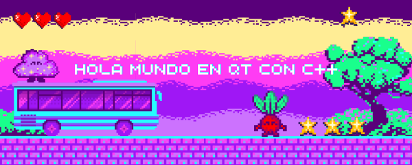

<div align="center">
  
</div>

# 💜 Hola Mundo en Qt con C++
# 👥 Autor

Desarrollado con 💜 Nikol Taipe

Pequeño proyecto de ejemplo en **Qt con C++** que muestra un "¡Hola Mundo!" 
con tipografía personalizada y un elegante color lila morado.


## 🚀 Cómo compilar y ejecutar

### Requisitos
- Qt 5 o Qt 6 instalado
- Un compilador de C++ (GCC, MinGW, MSVC, etc.)

### Compilación con qmake

```bash
qmake hola.pro
make            # En Linux/macOS
# mingw32-make  # En Windows con MinGW
./hola          # Ejecutar el programa
```

### Desde Qt Creator
1. Abre el archivo `hola.pro` con Qt Creator
2. Pulsa el botón ▶️ **Run**
3. ¡Listo!

---

## 📁 Estructura del proyecto

```
hola-mundo-qt/
├── main.cpp      → Código fuente principal
├── hola.pro      → Archivo de proyecto qmake
├── README.md     → Este archivo
└── captura.png   → Captura de pantalla del programa
```

---

## 💻 Código fuente

### `main.cpp`

```cpp
#include <QApplication>
#include <QLabel>
#include <QFont>

int main(int argc, char *argv[])
{
    QApplication app(argc, argv);

    QLabel label("¡Hola Mundo desde Qt!");
    label.setAlignment(Qt::AlignCenter);
    label.resize(400, 200);

    // 🎨 Tipografía personalizada
    QFont fuente("Georgia", 28, QFont::Bold);
    fuente.setStyleHint(QFont::Serif);
    label.setFont(fuente);

    // 💜 Color lila morado
    label.setStyleSheet(
        "QLabel { color: #9370DB; "
        "background-color: #F5EFFF; "
        "border-radius: 15px; "
        "padding: 20px; }"
    );

    label.show();

    return app.exec();
}
```

### `hola.pro`

```pro
QT       += core gui
greaterThan(QT_MAJOR_VERSION, 4): QT += widgets

TARGET = hola
TEMPLATE = app

SOURCES += main.cpp
```

---

## 🎨 Características

- ✅ Tipografía **Georgia** en negrita (28px)
- ✅ Color de texto **lila morado** (`#9370DB`)
- ✅ Fondo lila pastel (`#F5EFFF`)
- ✅ Bordes redondeados
- ✅ Padding cómodo

---

## 📸 Captura


---


